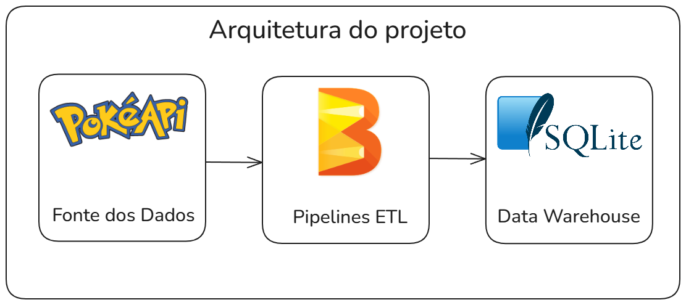

# ETL de Dados da PokéAPI com Apache Beam

Este projeto é uma pipeline de ETL (Extract, Transform, Load) que extrai dados da API pública do Pokémon (PokéAPI), realiza transformações e carrega os dados em um banco de dados SQLite local.

A pipeline é construída com o framework Apache Beam, o que a torna escalável e pronta para ser executada em ambientes distribuídos como o Google Cloud Dataflow, se necessário.

---

### Diagrama do projeto



---

---

### Funcionalidades

- **Extração (Extract):** Conecta-se à PokéAPI para buscar dados de Pokémon.
- **Transformação (Transform):** Limpa os dados, tratando campos nulos e removendo chaves desnecessárias do JSON.
- **Carregamento (Load):** Carrega os dados processados em um banco de dados SQLite.
- **Segregação de Dados:** Separa os Pokémons por tipo (Grass, Fire, Water) em tabelas dedicadas (`pokemons_grass`, `pokemons_fire`, `pokemons_water`) enquanto o restante é inserido na tabela principal (`pokemons`).

---

### Tecnologias Utilizadas

- **Python 3.x:** Linguagem de programação principal.
- **Apache Beam:** Framework de processamento de dados para a pipeline.
- **SQLite:** Banco de dados relacional para armazenar os dados transformados.
- **Requests:** Biblioteca Python para fazer a requisição à API.

---

### Como Executar o Projeto

#### 1. Pré-requisitos

Certifique-se de ter o Python 3.x instalado em sua máquina.

#### 2. Instalação das Dependências

Crie um ambiente virtual (opcional, mas recomendado) e instale as bibliotecas necessárias:

```bash
# Crie e ative um ambiente virtual
python -m venv venv
source venv/bin/activate  # macOS/Linux
venv\Scripts\activate     # Windows

# Instale as dependências
pip install apache-beam requests


